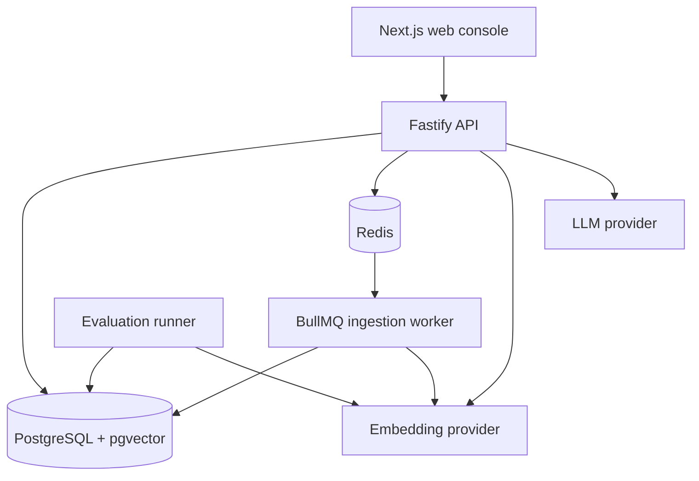

# Indexa — Repository Guide

This document describes the current architecture and the constraints that keep
Indexa understandable as it evolves. The repository and tests are the source
of truth when this document and the implementation differ.

## Project purpose

Indexa is local/self-hosted infrastructure for incremental RAG indexing,
retrieval, and evaluation. The system demonstrates reliable document
processing rather than a generic chat experience.

The core behavior is:

```text
upload → normalize → hash → version → queue → chunk →
reuse/embed → index → retrieve → generate with citations
```

When a document is reindexed, deterministic chunk hashes identify unchanged
content. Existing embeddings are reused for those chunks; only new or changed
chunks are sent to the embedding provider.

## Current scope

Supported document formats are Markdown and plain text (`.md` and `.txt`). The
system currently provides:

- versioned documents and deterministic token-aware chunks;
- SHA-256 content hashes and incremental embedding reuse;
- asynchronous BullMQ ingestion through Redis;
- idempotent, retry-safe, concurrency-safe indexing;
- PostgreSQL/pgvector cosine retrieval;
- grounded generation with source citations;
- job lifecycle inspection and service health;
- a Next.js operations console;
- a command-line retrieval evaluation harness.

PDF ingestion, authentication, billing, agents, graph RAG, multimodal inputs,
and multiple vector databases are out of scope.

## Architecture



Responsibilities are deliberately separated:

| Layer | Responsibility |
| --- | --- |
| `apps/web` | Routed console, typed API client, upload/reindex flows, polling, UI state |
| `apps/api` | HTTP validation, document/search/generation services, repositories, job enqueueing |
| `apps/worker` | Asynchronous ingestion, chunk comparison, embedding, chunk upserts, job transitions |
| `packages/document-processing` | Parser registry, normalization, content hashing |
| `packages/chunking` | Deterministic token chunking and heading propagation |
| `packages/embeddings` | Embedding interface, batching, and provider adapters |
| `packages/llm` | Generation interface and provider adapters |
| `packages/db` | Drizzle schema, migrations, PostgreSQL and pgvector access |
| `packages/evaluation` | Retrieval metric implementations |

## Data and job model

- A `document` is the logical source.
- A `document_version` preserves each indexed revision and its content hash.
- A `chunk` belongs to a version and stores content, metadata, token count, hash,
  and its vector.
- An `ingestion_job` records asynchronous processing state, attempts, errors,
  and lifecycle timestamps.

PostgreSQL is the persistent source of truth. Redis/BullMQ provides delivery,
retry, and queue state; it does not replace database state.

The relevant uniqueness guarantees are:

```text
(document_id, version)
(document_version_id, chunk_index)
(document_version_id) for ingestion jobs
```

Ingestion must remain safe under BullMQ's at-least-once execution model. Use
database constraints, short transactions, and upserts rather than application-
only existence checks. Never hold a database transaction open while waiting
for an embedding or LLM API.

## Provider boundaries

Keep vendor-specific behavior behind these interfaces:

```ts
interface EmbeddingProvider {
  embedDocuments(texts: string[]): Promise<number[][]>;
  embedQuery(text: string): Promise<number[]>;
}

interface LLMProvider {
  generate(input: { system?: string; prompt: string }): Promise<string>;
}
```

The repository includes deterministic fake providers for local development and
tests, plus OpenAI, Google Gemini, Anthropic generation, and OpenAI-compatible
adapters. Provider keys must never be returned by an API response or logged.

Runtime provider configuration is available through the Settings UI and
`GET/PUT /settings/ai`. It is intentionally held in API memory and resets when
the API restarts. The API and worker are separate processes, so ingestion
provider configuration must be available to the worker as well.

The database vector column is currently `vector(1536)`. A different embedding
dimension requires a schema migration and coordinated configuration changes.

## API contracts

```text
GET    /health
GET    /documents
POST   /documents
GET    /documents/:id
GET    /documents/:id/chunks
POST   /documents/:id/reindex
DELETE /documents/:id
GET    /jobs
GET    /jobs/:id
POST   /search
POST   /generate
GET    /settings/ai
PUT    /settings/ai
```

Routes should validate input with Zod and delegate business logic to services.
Repositories own database access. Error responses should be structured and
must not expose stack traces, credentials, or provider secrets.

## Frontend guidance

The web console is a first-class part of the project. Keep these areas
separate:

```text
/                 overview and pipeline state
/documents        document management
/documents/[id]   version, content, metadata, chunks
/playground       retrieval and generation experiments
/jobs             ingestion lifecycle
/evaluation       retrieval evaluation context
/settings         runtime configuration and health
```

Interactive requests must handle loading, empty, degraded, failure, success,
and cancellation states. Polling must stop on completion, failure, timeout,
navigation, or unmount. Prefer semantic HTML, keyboard-accessible controls,
visible focus states, and responsive layouts. Keep operational data real; do
not add fabricated metrics or placeholder success states.

## Testing and verification

Use deterministic fake providers for automated tests. Important coverage
includes:

- normalization, parsing, hashing, and deterministic chunking;
- unchanged chunk embedding reuse and changed chunk re-embedding;
- job idempotency, retry behavior, and concurrent execution;
- API error parsing and request cancellation;
- upload validation and upload failure handling;
- retrieval results, generation citations, and frontend empty/error states.

Before completing a change, run the relevant focused tests and then:

```bash
bun run lint
bun run typecheck
bun test
bun --cwd apps/web next build
```

Integration tests require PostgreSQL and Redis. If infrastructure is
unavailable, report that limitation instead of presenting a partial check as a
full verification.

## Development principles

1. Inspect existing routes, schemas, services, repositories, and tests before
   changing behavior.
2. Keep changes focused and preserve stable backend contracts.
3. Prefer the smallest implementation that makes the behavior observable and
   testable.
4. Keep parsing, chunking, hashing, embedding, indexing, retrieval, and HTTP
   concerns separate.
5. Treat jobs as at-least-once and make every indexing operation retry-safe.
6. Do not introduce authentication, billing, agents, extra queues, or new
   infrastructure without a concrete requirement.
7. Update the README and handover notes when architecture or user-visible
   behavior changes.
