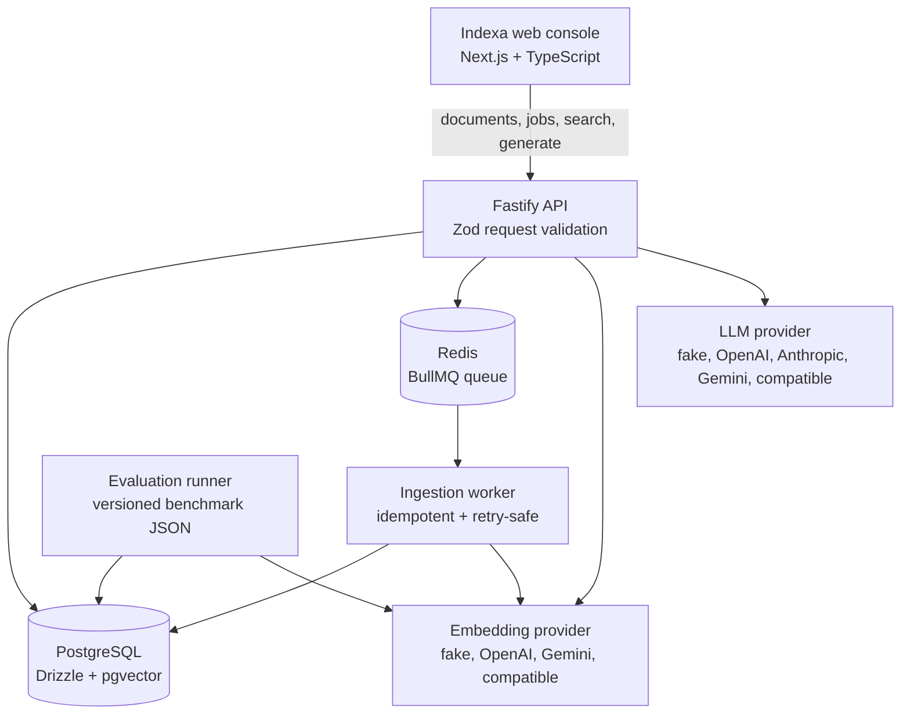
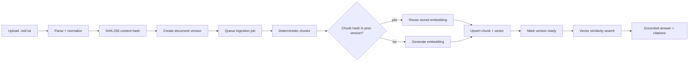

# Indexa

**Incremental RAG indexing, retrieval, and evaluation infrastructure.**

Indexa is a local/self-hosted developer tool for understanding what happens
inside a production-minded RAG pipeline. It accepts Markdown and text
documents, creates deterministic versions and chunks, stores embeddings in
PostgreSQL/pgvector, exposes retrieval and grounded generation, and makes
ingestion jobs observable from a web console.

The central design decision is incremental indexing: when a document changes,
Indexa compares chunk hashes and reuses embeddings for unchanged chunks. Only
new or modified chunks are embedded again.


> The screenshot path is a placeholder. Add `docs/indexa-console.png` when a
> local console screenshot is available.

## Why this project is interesting

Indexa is intentionally more than a document uploader or chat demo. It is a
small system for exploring the reliability boundaries of RAG infrastructure:

- deterministic normalization, hashing, and token chunking;
- versioned documents with idempotent ingestion jobs;
- incremental embedding reuse across document versions;
- asynchronous processing through BullMQ and Redis;
- vector retrieval through PostgreSQL/pgvector;
- grounded answers with inspectable citations;
- explicit job states, attempts, failures, retries, and dependency health;
- a retrieval evaluation harness with Recall@K, MRR, nDCG, and latency.

The web application is an observability and experimentation console for those
behaviors, not a chatbot-shaped product shell.

## Architecture



### Ingestion and retrieval flow



### Incremental embedding reuse

Each version retains the normalized content and its deterministic chunks. A
chunk hash is used as the reuse key when processing the next version. If the
same chunk appears again, its existing vector can be reused; changed chunks
are embedded and persisted normally. Database uniqueness constraints and the
BullMQ job ID make retries and concurrent processing safe.

Reuse counters are currently available in ingestion metrics/logging rather than
as persisted historical dashboard data. The UI therefore explains the reuse
behavior without inventing a savings percentage or time series.

## Web console

The frontend is a routed Next.js application with a persistent responsive shell,
light/dark/system themes, typed API requests, cancellation-aware polling, and
explicit loading, empty, degraded, and error states.

| Route | Purpose |
| --- | --- |
| `/` | Pipeline overview, service health, document status, recent activity, upload |
| `/documents` | Searchable and filterable document index with upload and deletion |
| `/documents/[id]` | Version details, content, metadata, and chunk explorer |
| `/playground` | Retrieve or generate experiments with ranked results and citations |
| `/jobs` | Paginated ingestion job list with active-state refresh |
| `/jobs/[id]` | Complete job lifecycle, attempts, duration, and errors |
| `/evaluation` | Retrieval metrics explainer and evaluation dataset/runner context |
| `/settings` | Runtime provider configuration, health, theme, and local commands |

AI provider keys are entered through Settings and sent only to the API. The
API returns provider/model and configured-state information, never stored
secrets. Runtime settings are held in API memory and reset when the API
restarts. Anthropic is generation-only because it is not an embedding provider.

## Technology stack

| Area | Technology |
| --- | --- |
| Runtime | Bun + TypeScript (strict) |
| Web | Next.js App Router, React, Tailwind CSS, Lucide |
| API | Fastify + Zod |
| Async processing | BullMQ + Redis |
| Database | PostgreSQL + pgvector + Drizzle ORM |
| AI integrations | Provider interfaces with fake, OpenAI, Gemini, Anthropic, and OpenAI-compatible adapters |
| Infrastructure | Docker Compose |
| Quality | Bun test, TypeScript, Biome |

## Repository layout

```text
apps/
  api/                    Fastify routes, services, repositories
  worker/                 BullMQ ingestion worker and processors
  web/                    Next.js developer console
packages/
  db/                     Drizzle schema, migrations, pgvector helpers
  document-processing/   Parsers, normalization, hashing
  chunking/               Deterministic token chunker
  embeddings/             Embedding interface and provider adapters
  llm/                    Grounded generation interface and adapters
  evaluation/             Retrieval metric implementations
evaluation/
  datasets/               Version-controlled questions and source documents
  scripts/                Evaluation runner
  benchmarks/             Generated benchmark results
```

## Run locally

### 1. Install dependencies and start infrastructure

```bash
bun install
cp .env.example .env
bun run infra:up
bun run db:migrate
```

Docker Compose starts PostgreSQL with pgvector on `localhost:5432` and Redis
on `localhost:6379`. The API validates `DATABASE_URL`, `REDIS_URL`, chunking
settings, and the fixed `VECTOR_DIMENSION=1536` at startup.

### 2. Start the services

Run each command in its own terminal:

```bash
bun run dev:api       # http://127.0.0.1:3000
bun run dev:worker    # BullMQ ingestion worker
bun run dev:web       # http://127.0.0.1:3001
```

Set `NEXT_PUBLIC_API_URL` if the API is not running at
`http://127.0.0.1:3000`.

### 3. Configure a real AI provider

Open `http://127.0.0.1:3001/settings` and configure embedding and generation
providers there. Supported providers are OpenAI, Google Gemini, Anthropic for
generation, and OpenAI-compatible gateways such as OpenRouter, Groq, or
Together. The local deterministic providers remain available for development
when no external key is configured.

The worker and API are separate processes. If ingestion should use a real
embedding provider, configure the corresponding worker environment as well as
the API runtime settings.

## API surface

The API keeps the core contracts small and inspectable:

```text
GET    /health
GET    /documents?limit=&offset=&status=
POST   /documents
GET    /documents/:id
GET    /documents/:id/chunks
POST   /documents/:id/reindex
DELETE /documents/:id
GET    /jobs?limit=&offset=&status=
GET    /jobs/:id
POST   /search
POST   /generate
GET    /settings/ai
PUT    /settings/ai
```

`GET /jobs` is the paginated list endpoint used by the Jobs screen. The
`/settings/ai` endpoints expose only safe runtime configuration state and are
the only new settings endpoints added for the frontend. `GET /health` returns
per-dependency status for PostgreSQL, pgvector, and Redis and returns `503`
when the system is degraded.

Example requests:

```bash
# Create a document version
curl -s -X POST http://127.0.0.1:3000/documents \
  -H 'content-type: application/json' \
  -d '{"filename":"notes.md","content":"# Title\n\nBody text"}' | jq

# Inspect an ingestion job
curl -s http://127.0.0.1:3000/jobs/<jobId> | jq

# Search indexed chunks
curl -s -X POST http://127.0.0.1:3000/search \
  -H 'content-type: application/json' \
  -d '{"query":"how does chunking work?","topK":5}' | jq

# Generate a cited answer
curl -s -X POST http://127.0.0.1:3000/generate \
  -H 'content-type: application/json' \
  -d '{"query":"How does incremental indexing work?","topK":5}' | jq
```

## Evaluation

The evaluation harness uses the version-controlled dataset in
`evaluation/datasets/retrieval.json` and the synthetic source documents under
`evaluation/datasets/documents/`. It runs retrieval against pgvector and writes
timestamped JSON results to `evaluation/benchmarks/`.

```bash
bun run evaluate
bun run evaluate -- --topK 10
CHUNK_SIZE=256 CHUNK_OVERLAP=32 bun run evaluate
```

The implemented metrics are Recall@K, Precision@K, MRR, nDCG@K, average
latency, p50/p95 latency, and embedding counts. The web Evaluation screen is
deliberately honest about whether stored results are available; generated
benchmark files are not treated as production telemetry.

## Quality checks

```bash
bun run lint
bun run typecheck
bun test
bun --cwd apps/web next build
```

Integration tests use PostgreSQL and Redis when the relevant environment is
available. The reliability suite covers idempotency, concurrent workers,
retry-safe ingestion, incremental processing, job polling, and search. The web
tests cover API error parsing, cancellation handling, supported file
validation, and client request contracts.

## Current limitations

- Markdown and plain text are supported; PDF ingestion is not implemented.
- Runtime AI settings are in-memory and reset when the API restarts.
- Reuse metrics are logged/counted during ingestion but are not yet persisted
  as historical dashboard metrics.
- The vector schema is fixed at 1536 dimensions; changing it requires a new
  database migration.
- Large-content streaming and object storage are outside the current scope.

See [`CLAUDE.md`](CLAUDE.md) for the project specification and
[`handover.md`](handover.md) for implementation history and verification notes.
